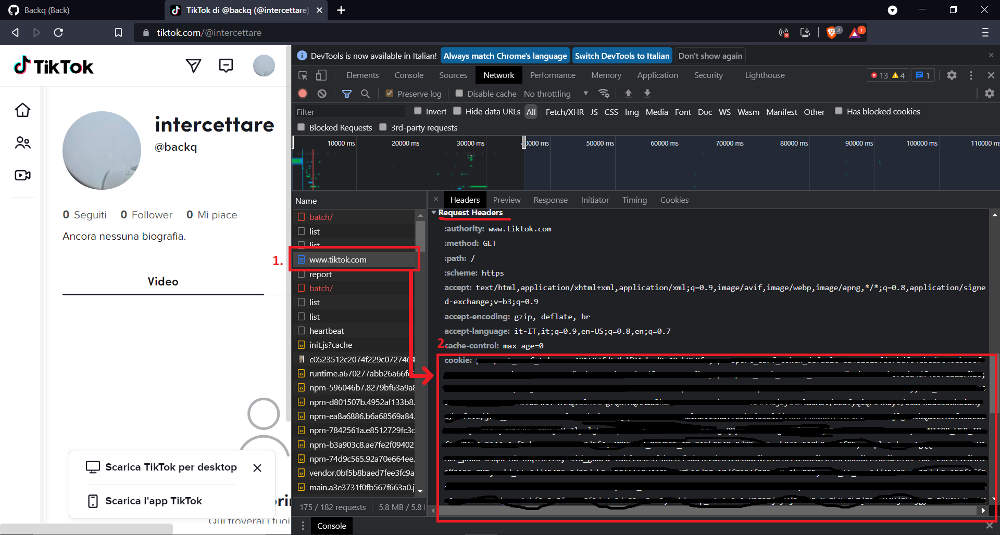

<h1 align="center">Tik Tok Name Availability Checker</h1>

# Tik Tok Name Availability Checker
> This is a program for check if a username is available on tiktok.
> This checker doesn't check if the username is banned or not, so banned usernames will be flagged as "Available".
> If you want it better, implement it in your own way, this is just a SIMPLE example.
> NOTE: Before using this source / program, you need to get your own cookie header, using your own account.
> There are no checks for ip so you can send request without a proxy list.

<h2>How to use the checker / How to get 'cookie' header</h2>

 As I said, you need to fill the txt file with your 'cookie'.
 

 Visit TikTok's website, log in, press F12 and visit your profile page.
 

 Find "www.tiktok.com" into your name list and then press it.
 

 Now scroll down once you find the header "cookie" into 'Request Headers' and then copy & paste his content into "Cookie.txt".
 

  

